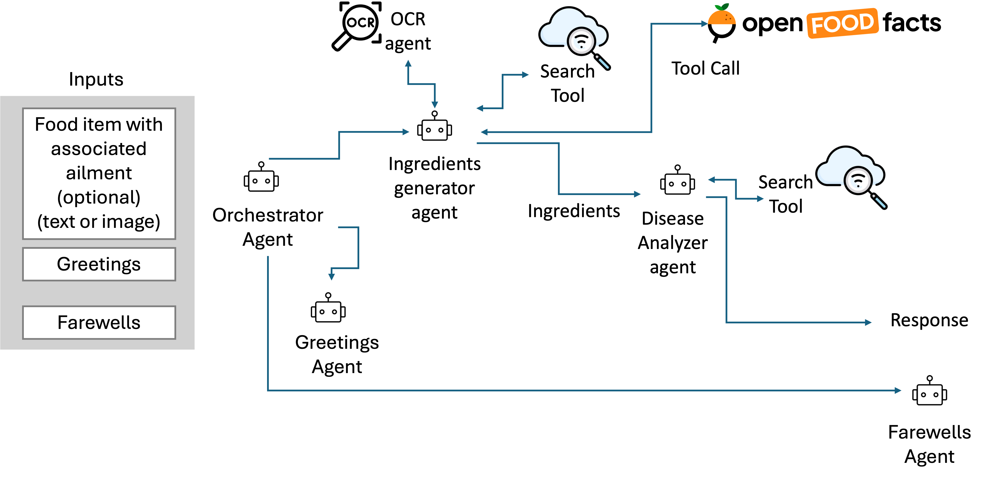

## nutri_agent

Multi-Agent Nutrition Application built with Google ADK 

## Agents-Tools Interaction


### Components

- **orchestrator_agent**: Root agent that coordinates all sub-agents
- **greetings_handler**: Handles greeting interactions
- **farewell_handler**: Handles farewell interactions  
- **ingredients_generator**: Generates ingredients list
- **disease_analyzer**: Called as a tool by ingredients_generator

## Usage

### Prerequisites

- Python 3.10+
- A Gemini API key (set in `.env`)

### Setup

1. Clone the repo and enter the project directory:
   ```bash
   cd nutri_agent
   ```

2. Create a virtual environment and install dependencies:
   ```bash
   python -m venv .venv
   source .venv/bin/activate   # On Windows: .venv\Scripts\activate
   pip install google-adk google-genai openfoodfacts
   ```

3. Add a `.env` file in the project root with your Gemini API key:
   ```
   GEMINI_API_KEY=your_api_key_here
   ```

### Run the app

The main entry point reads the user query from `query.txt` and runs the orchestrator agent:

1. Edit `query.txt` and put your question on the first line (e.g. *effect of paan on lungs*, or *what's in Coca-Cola*).
2. Run:
   ```bash
   python main.py
   ```
3. The final agent response is printed to the console.

### Optional: Open Food Facts CLI

To test nutriment lookup and grouping directly:

```bash
python -m sub_agents.ingredients_generator.open_food_facts_tools "Coca-Cola"
```

## Project folder tree

```
nutri_agent/
├── .env
├── README.md
├── agent.py
├── config.py
├── main.py
├── prompts.py
├── query.txt
├── schema_and_tools.py
├── test_images/
│   ├── wrapper0.webp
│   ├── wrapper3.jpg
│   └── wrapper4.png
├── sub_agents/
│   ├── __init__.py
│   ├── farewell_handler/
│   │   ├── agent.py
│   │   ├── prompts.py
│   │   └── schema_and_tools.py
│   ├── greeting_handler/
│   │   ├── agent.py
│   │   ├── prompts.py
│   │   └── schema_and_tools.py
│   └── ingredients_generator/
│       ├── agent.py
│       ├── ocr_processing_tools.py
│       ├── open_food_facts_tools.py
│       ├── prompts.py
│       ├── schema_and_tools.py
│       └── sub_agents/
│           └── disease_analyser/
│               ├── agent.py
│               ├── prompts.py
│               └── schema_and_tools.py
└── utils/
    ├── __init__.py
    ├── environment.py
    └── session.py
```
